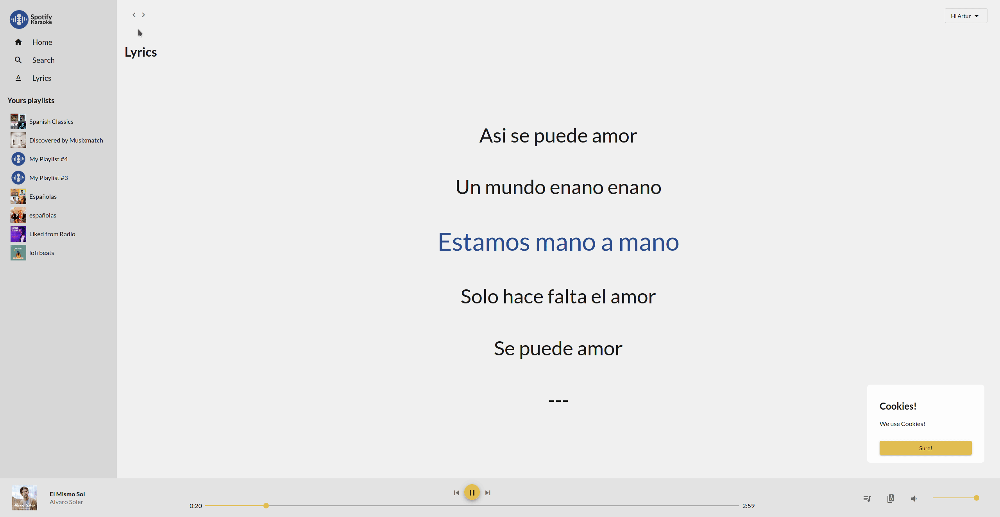

# Spotify Karaoke

[](spotify-karaoke.netlify.app/)
[](spotify-karaoke.netlify.app/)
[](https://github.com/ArturBa/spotify-karaoke/search?l=typescript)
[](./LICENCE)
[](https://github.com/ArturBa/spotify-karaoke/releases)
[](https://github.com/ArturBa/spotify-karaoke/actions/workflows/build_test.yml)
[](https://github.com/apps/dependabot)

## Why it's created

I wanted to try doing something bigger in Angular framework.

I like to sing along songs and spotify doesn't have a lyrics.

I've tried to implement that for them.

## Preview



## Used resources

- [minilyrics proxy](https://github.com/olee/minilyrics-proxy). Used to get a lyrics from a MiniLyrics. Thanks for your work
- [angular spotify](https://github.com/trungk18/angular-spotify). You need to check that out. This was a big inspiration for my project
- [lcr parser](https://github.com/anhthii/lrc-parser). I've adopted this parser for a getting a lyrics in object form

## Structure

```bash
root
├── apps
│   └── angular-spotify
└── libs
    ├── shared
    │   ├── interceptors (jest)
    │   ├── service (test)
    │   ├── test-helpers
    │   └── view (jest)
    └── web
        ├── lyrics
        │   ├── mini-lyrics
        │   ├── model (jest)
        │   └── view (jest)
        └── spotify
            ├── homepage
            ├── player
            ├── shared
            │   ├── helper (jest)
            │   ├── pipe (jest)
            │   ├── service
            │   └── view (Storybook)
            └── sidebar
```

## More details

Read more about:

- [Internationalization](./docs/i18n.md)
- [Technologies](./docs/technologies.md)
- [Tests](./docs/tests.md)
- [CI/CD](./docs/ci_cd.md)
